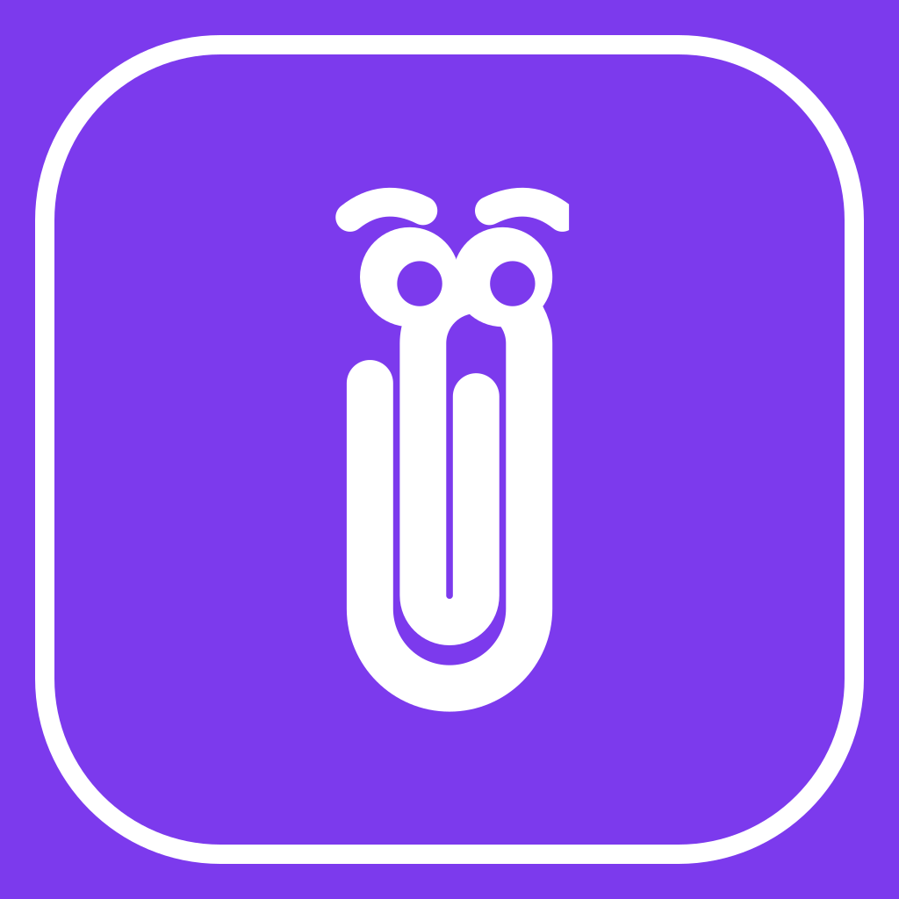

# Clippy

<p align="center">
  
</p>

<p align="center">
  <strong>Copy on one device. Paste on another.</strong><br />
  End-to-end encrypted clipboard sync for macOS, Windows, and Android.<br />
  No account. No cloud that can read your clips.
</p>

<p align="center">
  <a href="https://clippy.alwinpaul.me"></a>
  <a href="LICENSE"></a>
  <a href="https://github.com/alwinpaul1/clippy/actions/workflows/ci.yml"></a>
  
</p>

---

## Why Clippy?

Your clipboard is stuck on one machine. Clippy keeps a **shared, encrypted clipboard room** across the devices you pair — phone, laptop, desktop — so a link you copy on your Mac is ready to paste on your phone a moment later.

- **Private by design** — AES-256-GCM end-to-end encryption; the relay only sees ciphertext.
- **No accounts** — pair with a QR code (or paste the key). The master key never leaves your devices.
- **Works offline** — clips queue on the device and deliver when you reconnect.
- **Self-updating** — in-app updates from the same host that runs the relay.

> **Name note:** This project is unrelated to Microsoft Office’s assistant or the Rust `clippy` linter. Homepage: [clippy.alwinpaul.me](https://clippy.alwinpaul.me).

---

## Features

| Feature | Details |
|--------|---------|
| **Text & images** | Full-quality image sync (original bytes, no re-encode). |
| **History** | Browse recent clips, re-copy, multi-select delete, or clear the room. |
| **Android background** | Accessibility-driven capture (including Chrome URL bar) + screenshot sync while the app is closed. |
| **Desktop tray** | macOS menu bar / Windows system tray; hide-on-close keeps sync running. |
| **Reliable delivery** | Ack protocol, retries, idempotent resends — no silent drops or duplicates. |
| **In-app updates** | All three platforms check `version.json` and install from the relay’s download paths. |

---

## Install

**Preferred:** download builds from the site (always the latest release):

**→ [https://clippy.alwinpaul.me](https://clippy.alwinpaul.me)**

| Platform | Artifact |
|----------|----------|
| macOS | `.dmg` (manual) or `.zip` (in-app update) |
| Windows | `Clippy-Setup.exe` (per-user Inno installer) |
| Android | `Clippy-Android.apk` (release-signed) |

**Windows:** SmartScreen may warn until the installer is Authenticode-signed (see [Code signing](#code-signing-policy)). Choose *More info → Run anyway* only if you trust the download source.

**Pairing:** open Clippy on one device → show QR / key → scan or paste on the other. Same key = same room.

---

## Privacy model

Clippy’s relay is a **zero-knowledge router**:

1. Devices share a **256-bit master key** via QR (or text). The key is stored only on device (secure storage).
2. Clips are encrypted on-device with **AES-256-GCM** (keys derived via HMAC-SHA256).
3. The relay receives only **opaque room tokens** and **ciphertext** — never plaintext, keys, or personal identities.
4. Recent encrypted history is kept so devices that reconnect can catch up; deletes are flushed promptly.

This program does not send clipboard contents or pairing keys to third-party analytics services. Network use is limited to the sync relay and update checks you initiate by running the app.

---

## Architecture

```
┌──────────────┐     ┌──────────────┐     ┌──────────────┐
│  macOS app   │     │ Windows app  │     │ Android app  │
│  tray + UI   │     │  tray + UI   │     │  FGS + a11y  │
└──────┬───────┘     └──────┬───────┘     └──────┬───────┘
       │                    │                    │
       │         wss  ·  E2E ciphertext          │
       └────────────────────┼────────────────────┘
                            ▼
                 ┌─────────────────────┐
                 │  Dart WebSocket     │
                 │  relay (VPS)        │
                 │  rooms · history    │
                 │  /version.json      │
                 │  /download/*        │
                 └─────────────────────┘
```

| Path | Role |
|------|------|
| `lib/` | Flutter app — sync engine, crypto, history, updaters, platform glue |
| `android/` | Accessibility capture, screenshot observer, APK install channel |
| `macos/` / `windows/` | Desktop runners, tray, Windows Inno installer |
| `server/` | Zero-knowledge relay, download page, Dockerfile |

Default production relay: `wss://clippy.alwinpaul.me`  
Override at build time: `--dart-define=CLIPPY_RELAY_URL=wss://…`

---

## Development

### Prerequisites

- [Flutter](https://flutter.dev) (see CI for pinned version)
- For the relay: Dart SDK (or run only the app against a remote relay)
- Platform toolchains for the targets you build (Xcode, Android SDK, Visual Studio on Windows)

### Run the app

```bash
git clone https://github.com/alwinpaul1/clippy.git
cd clippy
flutter pub get
flutter run                    # current device / desktop
```

### Run a local relay

```bash
dart run server/bin/relay.dart   # :8080, in-memory history
flutter run --dart-define=CLIPPY_RELAY_URL=ws://localhost:8080
```

Persist history across restarts:

```bash
DB_PATH=/path/to/clippy.json dart run server/bin/relay.dart
```

### Tests

```bash
flutter test                 # app: engine, crypto, store, queue, UI
cd server && dart test       # relay: protocol, repository, durability
```

### Project layout (quick map)

```
lib/app/           UI, controllers, settings, updates
lib/core/          crypto, pairing, sync, WebSocket store, update logic
lib/platform/      tray, clipboard, updaters, Android FGS
server/lib/        relay implementation
server/web/        download page + staged /download artifacts (CI)
.github/workflows  CI: analyze, test, build all platforms, deploy VPS
```

---

## Releasing

1. Bump **SEMVER** in `pubspec.yaml` (`version: X.Y.Z+BUILD` — users only see `X.Y.Z`; always raise SEMVER for a release, and raise BUILD with it for Android).
2. Set matching `"version"` and notes in `release.json`.
3. Merge to `main` (PR). CI builds macOS / Windows / Android, writes `version.json` (with SHA-256), and deploys to the VPS when deploy secrets are set.

See [CLAUDE.md](CLAUDE.md) for full release and deploy invariants (Android keystore, artifact names, VPS flags).

---

## Code signing policy

See **[CODE_SIGNING_POLICY.md](CODE_SIGNING_POLICY.md)**.

Free Windows code signing for open-source releases is provided by
[SignPath.io](https://about.signpath.io), certificate by
[SignPath Foundation](https://signpath.org) (once approved).  
Until then, Windows builds may be unsigned and SmartScreen may warn.

More detail: [docs/windows-code-signing.md](docs/windows-code-signing.md).

---

## Security

- Treat the pairing QR/key like a password for your clipboard room.
- Anyone with the key can join the room and receive encrypted history (they still need the key to decrypt).
- Report security issues privately to the maintainer if possible; do not open public issues with exploit details.

---

## Contributing

Contributions are welcome.

1. Fork and branch from `main`.
2. Keep changes focused; match existing style.
3. Run `flutter test` and, if you touch the relay, `cd server && dart test`.
4. Open a PR with a clear description of *what* and *why*.

Please use multi-factor authentication on GitHub if you have write access.

---

## License

[MIT](LICENSE) © 2026 Alwin Paul

---

## Links

| | |
|--|--|
| Downloads | https://clippy.alwinpaul.me |
| Source | https://github.com/alwinpaul1/clippy |
| Update manifest | https://clippy.alwinpaul.me/version.json |
| Maintainer | [Alwin Paul](https://github.com/alwinpaul1) |
